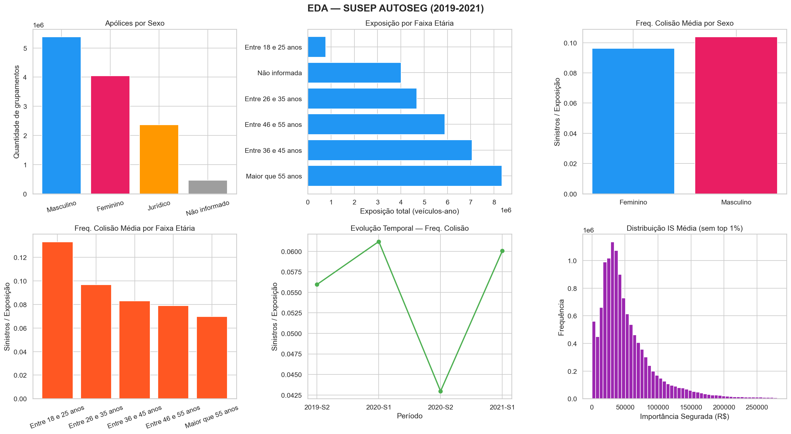
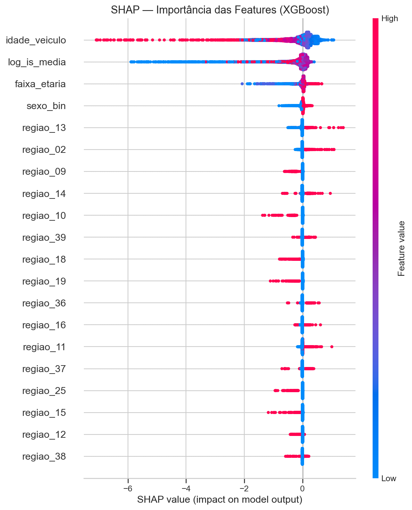
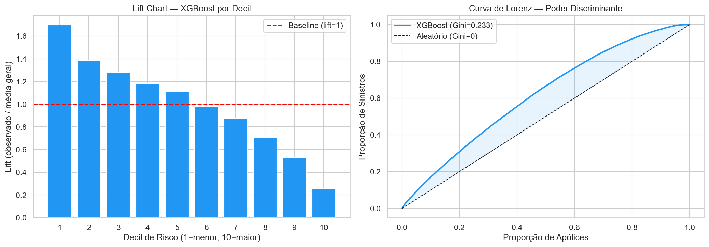

# 🚗 Insurance Pricing Model — SUSEP AUTOSEG

> Actuarial pricing model for Brazilian auto insurance using real regulatory data from SUSEP (2019–2021).  
> Modelo atuarial de precificação de seguro auto com dados reais da SUSEP (2019–2021).


[](https://insurance-pricing-susep.streamlit.app)

---

## 📌 Overview

This project builds an end-to-end auto insurance pricing model using **12.6 million policy records** from Brazil's insurance regulator (SUSEP). It combines classical actuarial methods (GLM) with modern machine learning (XGBoost + SHAP) and deploys an interactive pricing calculator via Streamlit.

---

## 🎯 Business Problem

How should an insurer price auto collision coverage given the policyholder's profile (age, gender, region) and vehicle characteristics (model year, insured value)?

The standard actuarial approach — and the regulatory expectation in Brazil — is to separate the pricing problem into two components: **how often** claims occur (frequency) and **how costly** they are when they do (severity). The pure premium is then their product.

---

## 📊 Data

| Source | Description | Records |
|--------|-------------|---------|
| SUSEP AUTOSEG 2019B | 2nd semester 2019 | 3,128,606 |
| SUSEP AUTOSEG 2020A | 1st semester 2020 | 3,210,981 |
| SUSEP AUTOSEG 2020B | 2nd semester 2020 | 2,941,865 |
| SUSEP AUTOSEG 2021A | 1st semester 2021 | 3,390,758 |
| **Total** | | **12,672,210** |

Data available at: https://www2.susep.gov.br/menuestatistica/autoseg/principal.aspx  
See [`data/raw/README.md`](data/raw/README.md) for download instructions.

---

## 🔬 Methodology & Theoretical Justifications

### 1. Temporal Train/Test Split
Data is split temporally: **train = 2019–2020**, **test = 2021**. A random split would leak future information into the training set, violating the causal structure of insurance pricing — models must be built on past data and validated on future periods.

### 2. GLM Poisson — Claim Frequency
- **Why Poisson?** Claim counts follow a Poisson process: events are rare, independent, and occur at a constant rate per unit of exposure. This is the standard actuarial assumption for frequency modeling (Ohlsson & Johansson, 2010).
- **Why a log offset for exposure?** Policyholders have different exposure periods (vehicle-years). The offset log(exposure) normalizes the prediction to a per-vehicle-year rate, which is the correct actuarial target.
- **Why 500k sample?** statsmodels requires the full design matrix in memory. At 6.5M rows × 44 features, this causes MemoryError. A stratified sample of 500k is sufficient for stable GLM estimation — the asymptotic properties of MLE hold well above ~50k observations.
- **Outlier threshold at p99:** The top 1% of freq_colisao_rel contains data entry errors and extreme micro-exposures. Removing them prevents the GLM from fitting to artifacts rather than signal.

### 3. GLM Gamma — Claim Severity
- **Why Gamma?** Claim costs are strictly positive and right-skewed — the Gamma distribution is the canonical actuarial choice for severity (McCullagh & Nelder, 1989). It assumes variance proportional to the mean squared, which matches empirical insurance severity distributions better than Gaussian or Log-Normal.
- **Why clip at p99?** The Gamma family requires y > 0 and is sensitive to extreme values. Clipping at p99 removes catastrophic outliers that should be handled by excess-of-loss reinsurance rather than the primary pricing model.
- **Why start_params + Newton?** With 40 regional dummies, near-multicollinearity slows convergence. Initializing with intercept = log(mean(y)) and using Newton's method (second-order) ensures stable convergence in fewer iterations.

### 4. Pure Premium
```
Pure Premium = Frequency × Severity
```
This two-component structure (frequency-severity, or freq-sev) is the industry standard for P&C pricing. It allows separate rating factors for each component and is required for regulatory filings in Brazil.

### 5. XGBoost with Tweedie Objective
- **Why Tweedie?** The pure premium distribution has a point mass at zero (no claim) and a continuous right tail (claim amount). The Tweedie distribution (variance power = 1.5) naturally handles this mixed discrete-continuous structure without requiring the freq-sev decomposition.
- **Why variance_power = 1.5?** Values between 1 and 2 define the Tweedie family. Power = 1.5 (compound Poisson-Gamma) is the standard choice for insurance data, balancing the Poisson (frequency) and Gamma (severity) components.
- **Why early stopping?** Running 1000 trees without validation wastes compute and risks overfitting. Early stopping on a 10% validation hold-out stopped at round 341, confirming the model generalizes well.
- **Why L1 + L2 regularization?** With 40+ sparse regional dummies, unregularized trees can overfit to rare region-specific patterns. reg_alpha=0.1 (L1) and reg_lambda=1.0 (L2) penalize complexity.
- **Why min_child_weight=10?** Prevents leaf nodes with fewer than 10 weighted observations — critical for sparse data where 90.6% of records have zero claims.

### 6. SHAP Explainability
- **Why SHAP?** SUSEP requires actuarial models to be interpretable and auditable. SHAP (SHapley Additive exPlanations) provides theoretically grounded, consistent feature attributions based on cooperative game theory (Lundberg & Lee, 2017). Unlike permutation importance, SHAP values are additive and respect feature interactions.

---

## 📈 Results

| Metric | GLM Poisson | XGBoost |
|--------|-------------|---------|
| MAE | 0.0571 | 0.0530 |
| Correlation | 0.0408 | 0.0851 |
| Gini | — | **0.233** |
| Best iteration | — | 341 / 1000 |

**Gini = 0.233** is within the typical range of 0.20–0.35 for auto insurance frequency models reported in the actuarial literature.

### Key Findings
- **COVID-19:** Collision frequency dropped ~25% in 2020-S1 due to lockdowns, recovering in 2021
- **Age effect:** Each older age band reduces collision frequency by ~13% (GLM coef: -0.132)
- **Gender:** Male drivers show ~4.8% higher collision frequency (GLM coef: +0.047)
- **Regional risk:** Tocantins (region 40) has the highest frequency; São Paulo metro (region 11) the lowest
- **Vehicle value:** Higher insured amounts correlate with both higher frequency and higher severity (SHAP: log_is_media is the 2nd most important feature)
- **Vehicle age:** Older vehicles have higher frequency but this effect is moderated by insured value (SHAP dependence plot)

---

## ⚠️ Limitations

- **Sampling:** GLM trained on 500k of 6.5M records. Full-dataset training (via `glum` or `sklearn`) could improve coefficient precision marginally but is unlikely to change conclusions given sample size.
- **No overdispersion test:** Negative Binomial was not tested as an alternative to Poisson. The Poisson assumption of equidispersion may be violated; future work should test with `sm.NegativeBinomial`.
- **Single coverage:** Only collision (`colisao`) is modeled. SUSEP AUTOSEG contains additional coverages (theft, fire, third-party liability) that would require separate models.
- **No temporal validation:** Beyond the train/test split, no rolling-window or walk-forward validation was performed.
- **Streamlit app loads pickle files locally:** The deployed app requires the `models/` directory with trained pickles. These are not versioned due to file size.

---

## 📸 Screenshots

### EDA — SUSEP AUTOSEG (2019–2021)


### GLM Evaluation — Observed vs Predicted


### XGBoost — SHAP Feature Importance


### Gini Curve & Lift Chart


---

## 🗂️ Project Structure
```
insurance-pricing-susep/
├── data/
│   ├── raw/                          # SUSEP AUTOSEG files (not versioned)
│   │   └── README.md                 # Download instructions
│   └── processed/                    # Parquet files (not versioned)
├── models/                           # Trained pickles (not versioned)
├── notebooks/
│   ├── 01_eda.ipynb                  # Exploratory Data Analysis
│   ├── 02_feature_engineering.ipynb  # Feature Engineering
│   ├── 03_glm_modeling.ipynb         # GLM Poisson + Gamma
│   └── 04_ml_comparison.ipynb        # XGBoost + SHAP + Gini
├── app/
│   └── streamlit_app.py              # Interactive pricing calculator
├── reports/figures/                  # Generated visualizations
├── src/
│   ├── data_loader.py                # Data loading utilities
│   ├── preprocessing.py              # Cleaning and feature engineering
│   └── modeling.py                   # GLM, XGBoost, Gini, Lift Chart
├── requirements.txt
└── README.md
```

---

## 🚀 How to Run
```bash
git clone https://github.com/arthurpmotta02/insurance-pricing-susep.git
cd insurance-pricing-susep
python -m venv venv
venv\Scripts\activate       # Windows
source venv/bin/activate    # Linux/Mac
pip install -r requirements.txt

# Download SUSEP data (see data/raw/README.md)
# Run notebooks 01 → 02 → 03 → 04 in order
jupyter notebook

# Run Streamlit app
streamlit run app/streamlit_app.py
```

---

## 👤 Author

**Arthur Pontes Motta**  
Statistics & Actuarial Science — UFRJ  
[GitHub](https://github.com/arthurpmotta02) · [LinkedIn](https://linkedin.com/in/arthurpmotta)

---

## 📄 License

MIT License — feel free to use and adapt with attribution.