# 🚗 Insurance Pricing Model — SUSEP AUTOSEG

> Actuarial pricing model for Brazilian auto insurance using real regulatory data from SUSEP (2019–2021).  
> Modelo atuarial de precificação de seguro auto com dados reais da SUSEP (2019–2021).


[](https://insurance-pricing-susep.streamlit.app)

---

## 📌 Overview

This project builds an end-to-end auto insurance pricing model using **12.6 million policy records** from Brazil's insurance regulator (SUSEP). It combines classical actuarial methods (GLM) with modern machine learning (XGBoost + SHAP), models **collision and theft separately**, and deploys an interactive pricing calculator via Streamlit.

---

## 🎯 Business Problem

How should an insurer price auto insurance (collision + theft) given the policyholder's profile (age, gender, region) and vehicle characteristics (model year, insured value)?

The standard actuarial approach — and the regulatory expectation in Brazil — is to separate the pricing problem into two components: **how often** claims occur (frequency) and **how costly** they are when they do (severity). The pure premium is then their product. This project models **collision and theft as separate risks**, reflecting their different risk drivers.

---

## 📊 Data

| Source | Description | Records |
|--------|-------------|---------|
| SUSEP AUTOSEG 2019B | 2nd semester 2019 | 3,128,606 |
| SUSEP AUTOSEG 2020A | 1st semester 2020 | 3,210,981 |
| SUSEP AUTOSEG 2020B | 2nd semester 2020 | 2,941,865 |
| SUSEP AUTOSEG 2021A | 1st semester 2021 | 3,390,758 |
| **Total** | | **12,672,210** |

Data available at: https://www2.susep.gov.br/menuestatistica/autoseg/principal.aspx  
See [`data/raw/README.md`](data/raw/README.md) for download instructions.

---

## 🔬 Methodology & Theoretical Justifications

### 1. Separate Models per Coverage
Collision and theft are modeled independently. The correlation between their frequencies is **0.021** — effectively zero — meaning their risk drivers are distinct. Regions with high collision frequency do not necessarily have high theft frequency (e.g. Mato Grosso has high collision but average theft; Rio de Janeiro metro has high theft but average collision). A joint model would average out these differences.

### 2. Temporal Train/Test Split
Data is split temporally: **train = 2019–2020**, **test = 2021**. A random split would leak future information into the training set, violating the causal structure of insurance pricing.

### 3. GLM Poisson — Claim Frequency
- **Why Poisson?** Claim counts follow a Poisson process: rare, independent events at a constant rate per unit of exposure (Ohlsson & Johansson, 2010).
- **Why log offset?** Normalizes predictions to a per-vehicle-year rate regardless of exposure period.
- **Why 500k sample?** Sufficient for stable MLE (asymptotic properties hold above ~50k), avoids MemoryError with 6.5M × 44 features.
- **Outlier threshold at p99:** Removes data entry errors and micro-exposures without discarding legitimate extreme events.

### 4. GLM Gamma — Claim Severity
- **Why Gamma?** Strictly positive, right-skewed — the canonical actuarial choice for severity (McCullagh & Nelder, 1989).
- **Why clip at p99?** Removes catastrophic outliers handled by reinsurance rather than primary pricing.
- **Why start_params + Newton?** Near-multicollinearity from 40 regional dummies slows convergence; initializing with log(mean(y)) and Newton's method ensures stability.

### 5. Pure Premium
```
Pure Premium = Frequency × Severity
```
Applied separately for collision and theft, then summed:
```
PP_total = PP_collision + PP_theft
```

### 6. XGBoost with Tweedie Objective
- **Why Tweedie?** Handles the mixed discrete-continuous structure (point mass at zero + continuous tail) without requiring the freq-sev decomposition.
- **Why variance_power = 1.5?** Standard choice for insurance data (compound Poisson-Gamma).
- **Why early stopping?** Stopped at round 274 (collision) and 65 (theft), confirming good generalization.
- **Why L1 + L2 regularization?** Prevents overfitting to rare region-specific patterns with 40+ sparse dummies.
- **Why min_child_weight=10?** Prevents leaf nodes with too few observations — critical with 90%+ zero claims.

### 7. SHAP Explainability
SHAP provides theoretically grounded feature attributions based on cooperative game theory (Lundberg & Lee, 2017). Key insight: **theft and collision have different top features** — `log_is_media` dominates theft (non-linearly: mid-value vehicles stolen most) while `idade_veiculo` dominates collision (newer vehicles crash more).

### 8. Market Premium Analysis
The project compares the modeled pure premium against SUSEP's reported market premium (`PREMIO1`), calculating an implicit loss ratio by region and profile. This reveals relative over/underpricing across the market — not in absolute terms (market premium includes loadings, expenses, profit) but in relative adequacy across segments.

---

## 📈 Results

### GLM vs XGBoost

| Metric | GLM — Collision | XGBoost — Collision | GLM — Theft | XGBoost — Theft |
|--------|----------------|---------------------|-------------|-----------------|
| MAE | 0.0571 | **0.0513** | 0.0138 | **0.0057** |
| Correlation | 0.0356 | **0.0854** | 0.1066 | **0.1215** |
| Gini | — | **0.241** | — | **0.402** |
| Best iteration | — | 274 / 1000 | — | 65 / 1000 |

**Gini = 0.402 for theft** is exceptionally strong — theft has a much clearer regional pattern than collision, making it more predictable.

### Key Findings
- **COVID-19:** Collision frequency dropped ~25% in 2020-S2 due to lockdowns, recovering in 2021. Theft showed a spike in 2021-S1.
- **Gender:** Male drivers show 6.4% higher collision frequency and **40.5% higher theft frequency** (GLM coefficients).
- **Vehicle value:** Higher IS correlates with higher collision frequency but lower theft frequency — expensive vehicles likely have trackers and private garages.
- **Regional theft:** Rio de Janeiro metro has 3× the theft frequency of the lowest-risk regions (SHAP: regiao_18 is the strongest regional signal for theft).
- **Market adequacy:** Loss ratio ranges from 27% (Amapá — market overprices) to 89% (Espírito Santo — market underprices), for collision + theft combined.
- **Age paradox:** 18-25 year olds have LR=21% — the market charges a large premium for young drivers but the data suggests they are relatively overcautious post-COVID.

### Pure Premium Summary
| Coverage | Avg Pure Premium | Share |
|----------|-----------------|-------|
| Collision | R$ 645.88 | 90.0% |
| Theft | R$ 71.46 | 10.0% |
| **Total (col + theft)** | **R$ 717.35** | 100% |

---

## ⚠️ Limitations

- **Fire excluded from modeling:** Fire coverage represents 1.3% of pure premium but showed 100% zeros in training data at the grupamento level — insufficient credibility for GLM. Priced via market tables in practice.
- **"Other coverages" excluded:** Assistance, glass, accessories represent 10.9% of pure premium but are heterogeneous — the AUTOSEG does not disaggregate by claim type.
- **Sampling:** GLM trained on 500k of 6.5M records.
- **No overdispersion test:** Negative Binomial not tested as alternative to Poisson.
- **Market premium is commercial:** Includes loadings, expenses and profit margin — loss ratio comparison is indicative of relative adequacy, not absolute.
- **Streamlit requires local pickle files:** Models versioned via Git LFS.

---

## 📸 Screenshots

### EDA — Overview
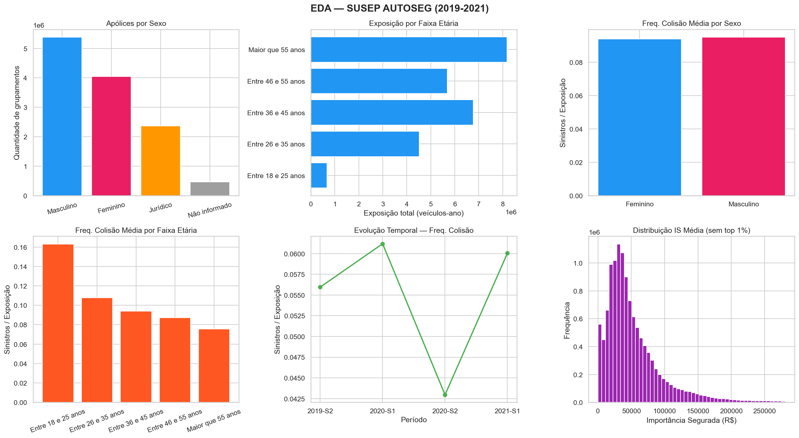

### EDA — Multi-Coverage Analysis (Collision, Theft, Fire)
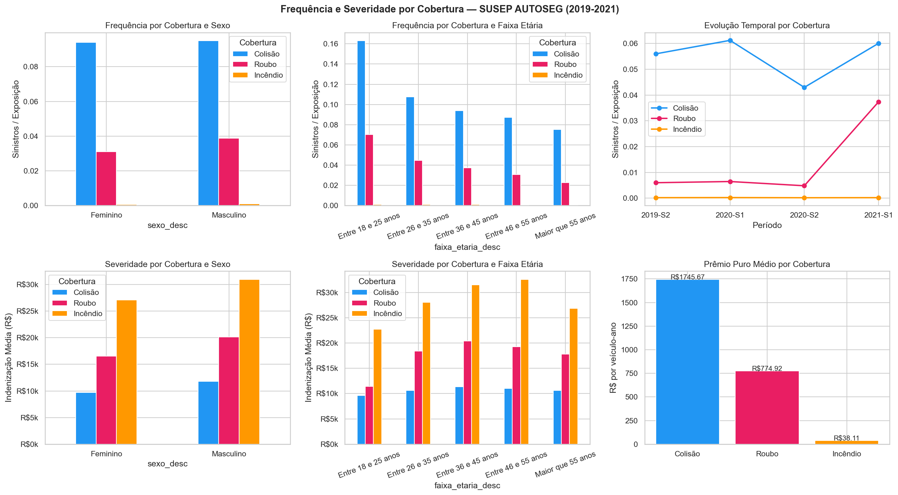

### EDA — Regional Analysis
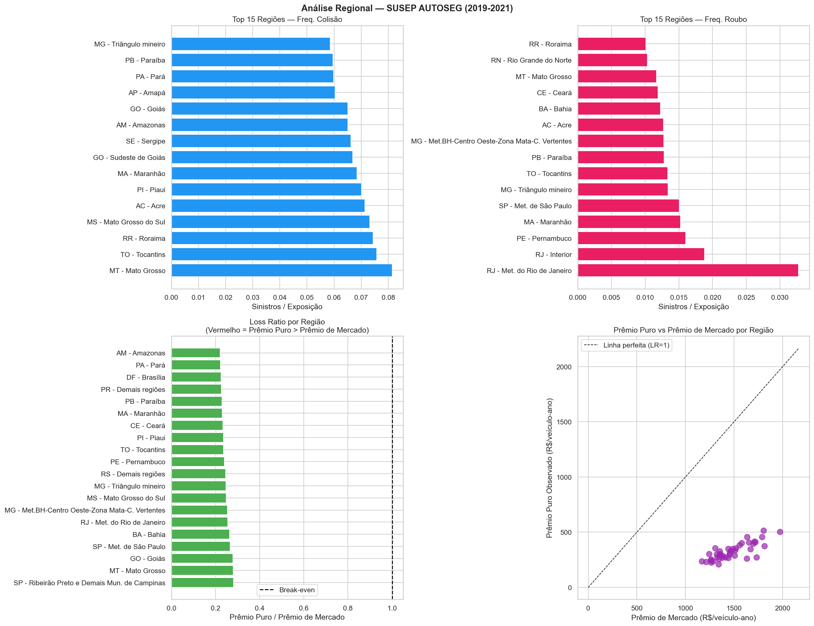

### EDA — Coverage Correlations
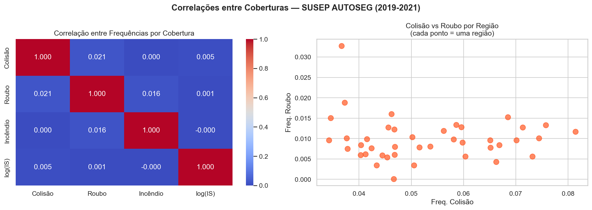

### Feature Engineering — Response Variable Distributions
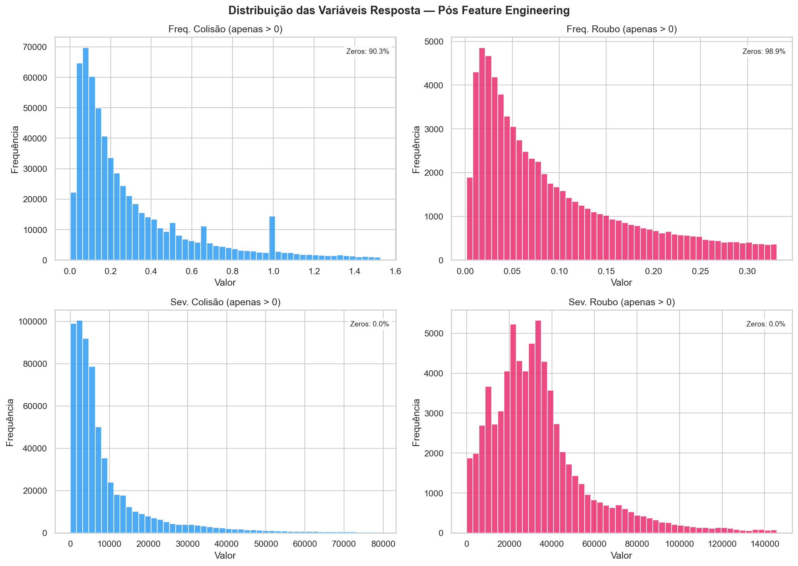

### GLM Evaluation — Collision and Theft
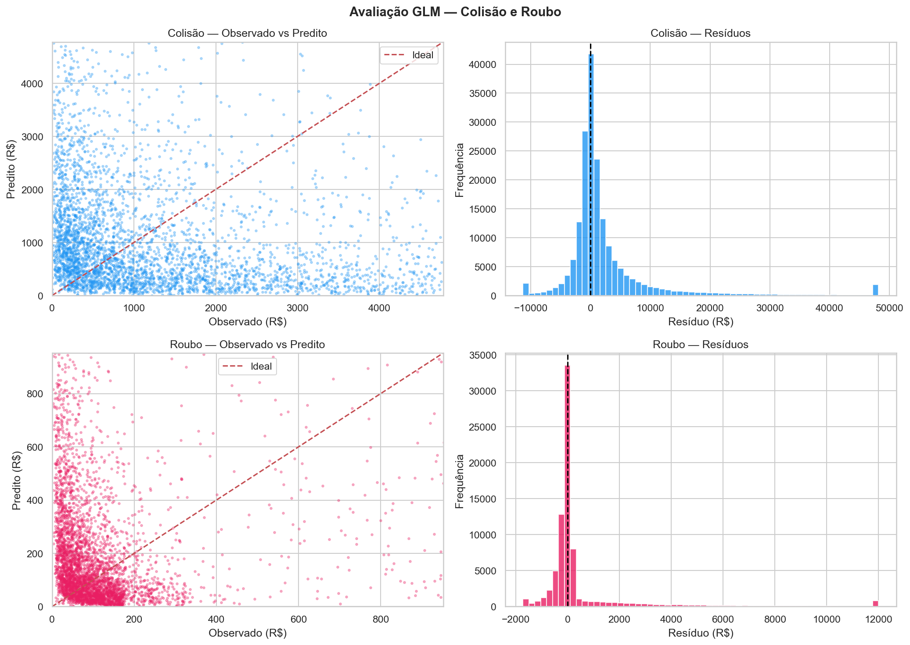

### Gini & Lift Chart — Collision (0.241) and Theft (0.402)
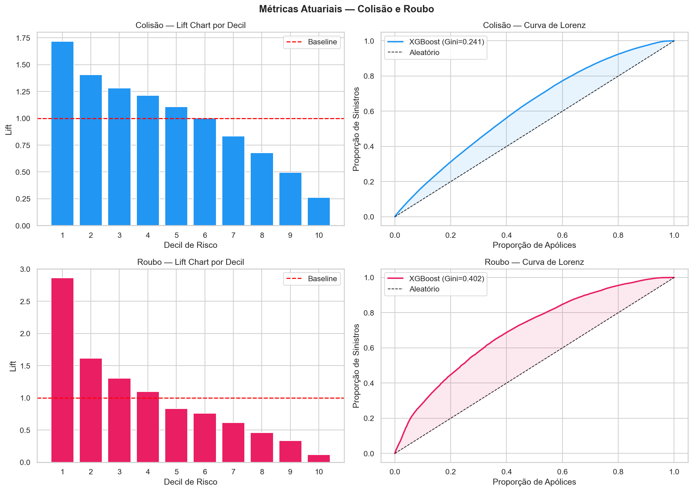

### SHAP — Collision Feature Importance
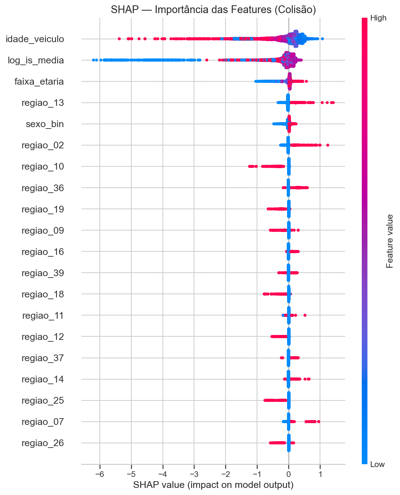

### SHAP — Theft Feature Importance
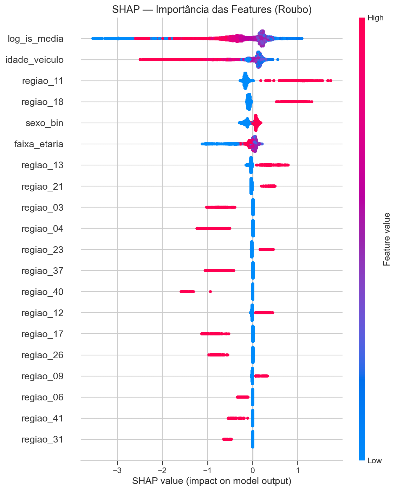

### SHAP Dependence — Collision
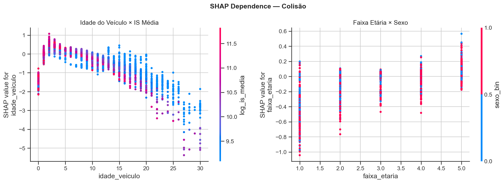

### SHAP Dependence — Theft
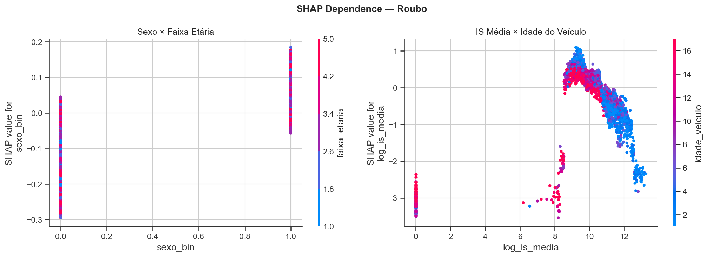

### Market Analysis — Loss Ratio by Region
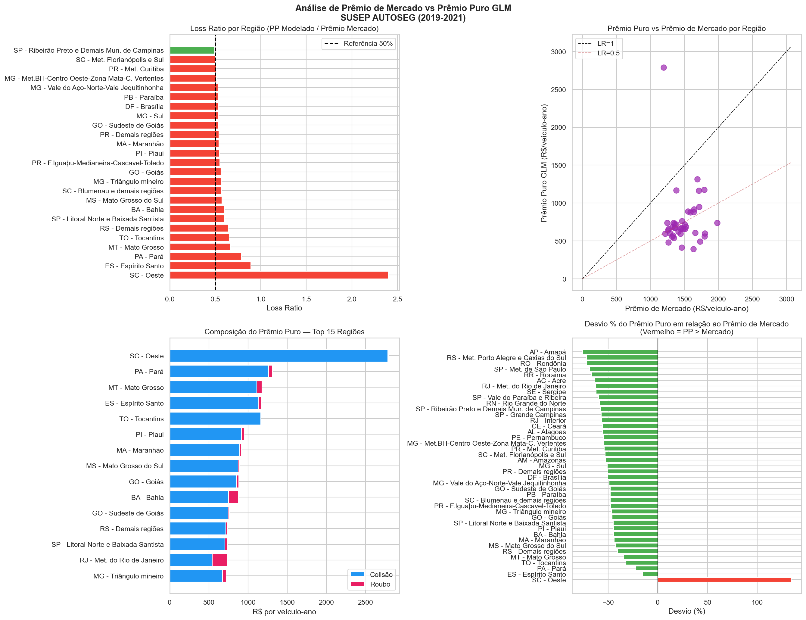

### Market Analysis — Loss Ratio by Profile
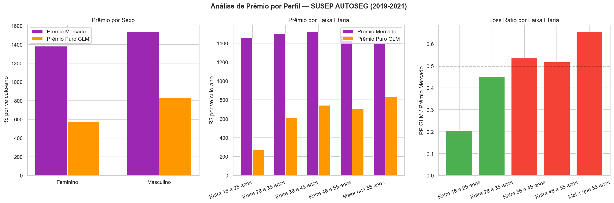

---

## 🗂️ Project Structure
```
insurance-pricing-susep/
├── data/
│   ├── raw/                          # SUSEP AUTOSEG files (not versioned)
│   │   └── README.md                 # Download instructions
│   └── processed/                    # Parquet files (not versioned)
├── models/                           # Trained pickles via Git LFS
├── notebooks/
│   ├── 01_eda.ipynb                  # EDA multi-coverage + market premium
│   ├── 02_feature_engineering.ipynb  # Feature engineering
│   ├── 03_glm_modeling.ipynb         # GLM Poisson + Gamma (collision + theft)
│   ├── 04_ml_comparison.ipynb        # XGBoost + SHAP + Gini (collision + theft)
│   └── 05_market_analysis.ipynb      # Market premium vs pure premium
├── app/
│   └── streamlit_app.py              # Interactive pricing calculator
├── reports/figures/                  # Generated visualizations
├── src/
│   ├── data_loader.py
│   ├── preprocessing.py
│   └── modeling.py                   # GLM, XGBoost, Gini, Lift Chart
├── requirements.txt
└── README.md
```

---

## 🚀 How to Run
```bash
git clone https://github.com/arthurpmotta02/insurance-pricing-susep.git
cd insurance-pricing-susep
python -m venv venv
venv\Scripts\activate       # Windows
source venv/bin/activate    # Linux/Mac
pip install -r requirements.txt

# Download SUSEP data (see data/raw/README.md)
# Run notebooks 01 → 02 → 03 → 04 → 05 in order
jupyter notebook

# Run Streamlit app
streamlit run app/streamlit_app.py
```

---

## 👤 Author

**Arthur Pontes Motta**  
Statistics & Actuarial Science — UFRJ  

[](https://github.com/arthurpmotta02)
[](https://linkedin.com/in/arthurpmotta)

---

## 📄 License

MIT License — feel free to use and adapt with attribution.